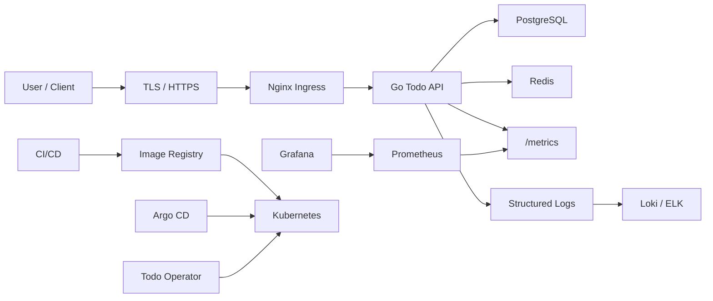

# 项目主线设计：Cloud Native Todo Platform

项目名称：**《Cloud Native Todo Platform》**

学习者从第一阶段开始，逐步构建一个完整的云原生系统。

最终形态包括：

- Go 编写的 Todo API 服务
- PostgreSQL 数据库
- Redis 缓存
- Nginx 或 Ingress 入口
- Dockerfile
- Docker Compose 本地开发环境
- Kubernetes YAML 部署
- Helm Chart
- 多环境配置 dev / test / prod
- CI/CD 流水线
- Prometheus 指标
- Grafana 看板
- Loki 或 ELK 日志收集
- HPA 自动扩缩容
- RBAC 权限控制
- NetworkPolicy 网络隔离
- TLS 证书
- Operator 自动化管理应用

## 1. 项目背景

`Cloud Native Todo Platform` 是一个从零构建、逐步生产化的云原生 Todo 管理平台。

它表面上是 Todo 系统，实际训练的是企业中最常见的一类能力：

- 后端 API 服务开发
- 数据库存储与缓存
- 本地开发环境编排
- 容器镜像构建
- Kubernetes 部署与运维
- 多环境发布
- CI/CD 与 GitOps
- 监控、日志、告警、排障
- Kubernetes Operator 自动化管理应用生命周期

最终学习者不是只会写一个 Todo API，而是能完整交付一个具备生产雏形的云原生应用体系。

## 2. 业务功能

核心业务功能：

- 用户注册、登录、JWT 鉴权
- Todo 创建、查询、更新、删除
- Todo 状态管理：待办、进行中、已完成、已归档
- Todo 优先级：低、中、高、紧急
- Todo 标签与关键字搜索
- Todo 分页、排序、过滤
- 用户级数据隔离
- 操作审计日志
- 健康检查接口
- Prometheus 指标接口
- 后台异步任务：统计用户 Todo 数量、清理归档数据
- 管理员接口：查看系统状态、触发维护任务

## 3. 技术架构

最终技术栈：

| 层级 | 技术 |
|---|---|
| 后端语言 | Go |
| Web 框架 | Gin 或 Chi |
| 数据库 | PostgreSQL |
| 缓存 | Redis |
| 入口 | Nginx / Kubernetes Ingress |
| 容器化 | Docker、Dockerfile、Docker Compose |
| 编排平台 | Kubernetes |
| 包管理 | Helm |
| 多环境配置 | Kustomize 或 Helm values |
| CI/CD | GitHub Actions / GitLab CI |
| GitOps | Argo CD |
| 指标 | Prometheus |
| 看板 | Grafana |
| 日志 | Loki 或 ELK |
| 扩缩容 | HPA |
| 安全 | RBAC、NetworkPolicy、TLS、SecurityContext |
| 自动化管理 | CRD、Controller、Operator |



## 4. 每个学习阶段要实现的功能

| 阶段 | 实现内容 | 对应能力 |
|---|---|---|
| 1. 环境准备 | 初始化仓库、安装 Go、Docker、kubectl、kind、Helm | 开发环境搭建 |
| 2. Linux 基础 | 创建项目目录、日志目录、配置目录 | Linux 文件与权限 |
| 3. Git 协作 | 建立分支模型、提交规范、PR 流程 | 团队开发 |
| 4. Shell 自动化 | 编写启动、检查、清理脚本 | 自动化基础 |
| 5. Go 基础 | 实现 CLI 版 Todo 管理器 | Go 语法与工程基础 |
| 6. Go Web API | 实现 Todo RESTful API | 后端服务开发 |
| 7. PostgreSQL | Todo 数据持久化、迁移脚本、事务 | 数据库开发 |
| 8. Redis | Todo 查询缓存、登录限流、统计缓存 | 缓存与高并发基础 |
| 9. 后端生产化 | JWT、日志、配置分层、健康检查、优雅关闭 | 生产级 API |
| 10. Dockerfile | 构建 Go API 镜像 | 容器镜像 |
| 11. Docker Compose | 本地启动 API、PostgreSQL、Redis、Nginx | 本地编排 |
| 12. 容器原理 | 分析镜像层、容器进程、资源限制 | 容器底层理解 |
| 13. Kubernetes YAML | 部署 API、PostgreSQL、Redis、Ingress | K8s 应用部署 |
| 14. K8s 网络 | Service、Ingress、NetworkPolicy | 服务访问与隔离 |
| 15. K8s 存储 | PVC、PostgreSQL 数据持久化 | 有状态服务 |
| 16. K8s 安全 | RBAC、Secret、SecurityContext、TLS | 安全基线 |
| 17. Helm | 打包 Todo Platform Chart | 应用发布 |
| 18. 多环境 | dev、test、prod 配置差异 | 环境治理 |
| 19. CI/CD | 自动测试、构建镜像、推送仓库 | 自动化交付 |
| 20. GitOps | Argo CD 管理发布 | 声明式运维 |
| 21. 监控 | 暴露指标、Prometheus 抓取、Grafana 看板 | 可观测性 |
| 22. 日志 | Loki / ELK 收集结构化日志 | 日志分析 |
| 23. HPA 与排障 | 压测、自动扩缩容、故障注入 | 生产排障 |
| 24. CRD | 设计 `TodoApp` 自定义资源 | API 扩展 |
| 25. Operator | 自动创建 Deployment、Service、Ingress、ConfigMap、Secret、HPA | 平台工程能力 |

## 5. 每个阶段的目录结构

课程仓库最终采用单仓结构，随着学习阶段逐步扩展。

```text
cloud-native-todo-platform/
├── api/                       # Go Todo API 服务
│   ├── cmd/todo-api/
│   ├── internal/
│   │   ├── config/
│   │   ├── handler/
│   │   ├── service/
│   │   ├── repository/
│   │   ├── middleware/
│   │   └── model/
│   ├── migrations/
│   ├── tests/
│   └── Dockerfile
├── cli/                       # Go CLI 阶段项目
├── scripts/                   # Shell 自动化脚本
├── deployments/
│   ├── docker-compose/
│   ├── k8s-yaml/
│   ├── helm/todo-platform/
│   └── kustomize/
│       ├── base/
│       └── overlays/
│           ├── dev/
│           ├── test/
│           └── prod/
├── observability/
│   ├── prometheus/
│   ├── grafana/
│   └── loki/
├── operator/
│   ├── api/
│   ├── controllers/
│   ├── config/
│   └── test/
├── docs/
└── .github/workflows/
```

阶段目录演进：

| 阶段 | 主要新增目录 |
|---|---|
| 环境与 Linux | `docs/`、`scripts/` |
| Go CLI | `cli/` |
| Go API | `api/cmd/`、`api/internal/` |
| 数据库 | `api/migrations/`、`api/internal/repository/` |
| Docker | `api/Dockerfile` |
| Compose | `deployments/docker-compose/` |
| Kubernetes | `deployments/k8s-yaml/` |
| Helm | `deployments/helm/todo-platform/` |
| 多环境 | `deployments/kustomize/overlays/` |
| CI/CD | `.github/workflows/` |
| 可观测性 | `observability/` |
| Operator | `operator/` |

## 6. 每个阶段的验收标准

| 阶段 | 验收标准 |
|---|---|
| 环境准备 | 能在本机运行 `go version`、`docker version`、`kubectl version`、`helm version` |
| Linux | 能创建项目目录、修改权限、查看日志、排查端口 |
| Git | 能完成分支开发、提交、合并、解决冲突 |
| Shell | 能一键启动、检查、清理本地项目环境 |
| Go CLI | 能通过命令行新增、查询、完成 Todo |
| Go API | 能通过 HTTP 完成 Todo CRUD |
| PostgreSQL | 重启服务后 Todo 数据不丢失 |
| Redis | 高频查询能命中缓存，限流逻辑有效 |
| 生产化 | 支持 JWT、健康检查、结构化日志、优雅关闭 |
| Dockerfile | 能构建并运行 API 镜像 |
| Compose | 一条命令启动 API、PostgreSQL、Redis、Nginx |
| Kubernetes | API 能在集群内运行并通过 Ingress 访问 |
| 网络 | NetworkPolicy 生效，非授权流量被拒绝 |
| 存储 | PostgreSQL 使用 PVC，Pod 重建后数据保留 |
| 安全 | API 使用非 root 用户运行，Secret 不明文写入镜像 |
| Helm | 能用 Helm 安装、升级、回滚平台 |
| 多环境 | dev、test、prod 使用不同副本数、域名、资源配置 |
| CI/CD | push 后自动测试、构建镜像、发布制品 |
| GitOps | 修改 Git 配置后 Argo CD 自动同步集群 |
| 监控 | Grafana 能看到 QPS、延迟、错误率、资源使用 |
| 日志 | 能按 request_id 查询一次请求的完整日志 |
| HPA 排障 | 压测后副本自动扩容，故障能按流程定位 |
| CRD | 能创建 `TodoApp` 自定义资源 |
| Operator | 创建一份 `TodoApp` YAML 后自动部署整套 Todo Platform |

## 7. 最终项目完整架构

最终交付物包括：

```text
应用层：
- Go Todo API
- JWT 鉴权
- Todo CRUD
- 用户隔离
- 健康检查
- 指标暴露
- 结构化日志

数据层：
- PostgreSQL
- Redis
- 数据库迁移
- 缓存与限流

容器层：
- Dockerfile
- 多阶段构建
- 非 root 镜像
- Docker Compose 本地环境

Kubernetes 层：
- Namespace
- Deployment
- Service
- Ingress
- ConfigMap
- Secret
- PVC
- HPA
- RBAC
- NetworkPolicy
- TLS

交付层：
- Helm Chart
- Kustomize 多环境
- CI/CD Pipeline
- GitOps with Argo CD

可观测性层：
- Prometheus metrics
- Grafana dashboards
- Loki / ELK logs
- 告警规则

平台工程层：
- TodoApp CRD
- Todo Operator
- Webhook
- Finalizer
- OwnerReference
- Status Conditions
```

## 8. 项目如何体现真实工作能力

这个项目能覆盖真实公司中的完整工作链路：

- 后端工程师能力：API 设计、数据库、缓存、认证、测试、日志
- DevOps 能力：Docker、Compose、CI/CD、镜像仓库、自动发布
- Kubernetes 运维能力：部署、服务暴露、配置、密钥、存储、扩缩容、排障
- SRE 能力：监控指标、日志分析、故障注入、容量评估、告警设计
- 平台工程能力：Helm、多环境、GitOps、权限治理、Operator 自动化
- 安全意识：RBAC、NetworkPolicy、TLS、Secret、非 root 容器
- 生产意识：资源限制、探针、滚动更新、回滚、数据持久化、状态观测

它不是一个孤立 Demo，而是一条从开发到上线、从上线到运维、从运维到平台自动化的完整路径。

## 9. 项目如何用于面试展示

面试时可以按这条线讲：

1. 项目背景
   - 我做了一个云原生 Todo 平台，用它完整实践 Go 后端、容器化、Kubernetes、CI/CD、监控和 Operator。

2. 架构能力
   - 讲清楚 API、PostgreSQL、Redis、Ingress、Prometheus、Grafana、Loki、Argo CD、Operator 的关系。

3. 后端能力
   - 重点讲 RESTful API、JWT、数据库事务、Redis 缓存、限流、日志、测试。

4. 容器与 Kubernetes 能力
   - 重点讲 Dockerfile 优化、Compose 本地环境、Deployment、Service、Ingress、PVC、HPA、RBAC、NetworkPolicy。

5. 生产实践能力
   - 讲如何做健康检查、优雅关闭、资源限制、日志查询、指标监控、故障排查和回滚。

6. 高级亮点
   - 讲 `TodoApp` CRD 和 Operator：用户只需要提交一份 YAML，Operator 自动创建 API、配置、服务入口、HPA 和状态回写。

7. 可展示成果
   - GitHub 仓库
   - README 架构图
   - 本地 Compose 启动截图
   - Kubernetes 部署 YAML
   - Helm Chart
   - CI/CD 流水线截图
   - Grafana 看板截图
   - Operator CRD 示例
   - 故障排查文档

最终面试表达目标：

> 我不仅能写 Go 后端服务，也能把服务容器化、部署到 Kubernetes、接入监控日志、完成自动发布，并进一步用 Operator 把应用生命周期管理自动化。

