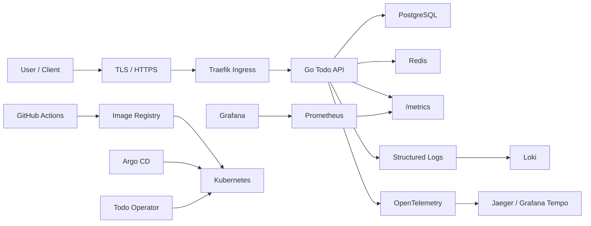

# 项目主线设计：Cloud Native Todo Platform

项目名称：**《Cloud Native Todo Platform》**

> **配套设计文档**：[01 课程蓝图](01-course-blueprint.md) | [02 完整课程目录](02-full-curriculum.md)

学习者从第一阶段开始，逐步构建一个完整的云原生系统。

最终形态包括：

- Go 编写的 Todo API 服务
- PostgreSQL 数据库
- Redis 缓存
- Traefik 入口
- Dockerfile（多阶段构建）
- Docker Compose 本地开发环境
- Kubernetes YAML 部署清单
- Helm 4 Chart
- Kustomize 多环境配置 dev / test / prod
- CI/CD 流水线（GitHub Actions）
- GitOps（Argo CD）
- Prometheus 指标
- Grafana 看板
- Loki 日志收集
- OpenTelemetry 链路追踪
- HPA 自动扩缩容
- RBAC 权限控制
- NetworkPolicy 网络隔离
- TLS 证书
- CRD 自定义资源
- Operator 自动化管理应用生命周期

## 1. 项目背景

`Cloud Native Todo Platform` 是一个从零构建、逐步生产化的云原生 Todo 管理平台。

它表面上是 Todo 系统，实际训练的是企业中最常见的一类能力：

- 后端 API 服务开发（标准库 → 框架 → 生产化）
- 数据库存储与缓存
- 本地开发环境编排
- 容器镜像构建与优化
- Kubernetes 部署与运维
- 多环境发布
- CI/CD 与 GitOps
- 监控、日志、告警、排障
- Kubernetes Operator 自动化管理应用生命周期

最终学习者不是只会写一个 Todo API，而是能完整交付一个具备生产雏形的云原生应用体系。

## 2. 业务功能

核心业务功能：

- 用户注册、登录、JWT 鉴权
- Todo 创建、查询、更新、删除
- Todo 状态管理：待办、进行中、已完成、已归档
- Todo 优先级：低、中、高、紧急
- Todo 标签与关键字搜索
- Todo 分页、排序、过滤
- 用户级数据隔离
- 操作审计日志
- 健康检查接口（liveness / readiness）
- Prometheus 指标接口（/metrics）
- 后台异步任务：统计用户 Todo 数量、清理归档数据
- 管理员接口：查看系统状态、触发维护任务

## 3. 技术架构

最终技术栈：

| 层级 | 技术 |
|---|---|
| 后端语言 | Go 1.26 |
| HTTP 标准库 | net/http（学习底层模型） |
| Web 框架 | Gin 1.12 |
| 数据库 | PostgreSQL 18 |
| 缓存 | Redis 8.2 |
| 入口 | Traefik Ingress Controller + Gateway API（进阶） |
| 容器化 | Docker 29.x、Dockerfile、Docker Compose |
| 编排平台 | Kubernetes 1.36 |
| 包管理 | Helm 4 |
| 多环境配置 | Kustomize + Helm values |
| CI/CD | GitHub Actions |
| GitOps | Argo CD |
| 指标 | Prometheus |
| 看板 | Grafana |
| 日志 | Loki |
| 链路追踪 | OpenTelemetry |
| 扩缩容 | HPA |
| 安全 | RBAC、NetworkPolicy、TLS、SecurityContext、User Namespaces |
| 自动化管理 | CRD → 手写 Controller → Kubebuilder Operator |



## 4. 项目版本演进路线

每个篇对应一个可独立验收的项目版本，版本之间逐步叠加：

```
v0.1-cli              Todo CLI（篇 7）
                        └─ Go 语法、内存存储

v0.2-api-stdlib       Todo API v1（篇 9）
                        └─ net/http 标准库、JSON 序列化

v0.3-api-gin          Todo API v2（篇 10）
                        └─ Gin 框架、RESTful 设计

v0.3.1-concurrency    并发统计任务（篇 11）
                        └─ goroutine/channel/context

v0.4-persistence      Todo API v3（篇 12）
                        └─ PostgreSQL、数据库迁移

v0.5-cache            Todo API v4（篇 13）
                        └─ Redis 缓存、限流

v0.6-production       Todo API v5（篇 14）
                        └─ JWT、日志、配置分层

---
v1.0-container        Todo Platform 容器化（篇 15-19）
                        └─ Dockerfile + Compose + 原理

---
v2.0-k8s              Todo Platform on K8s（篇 20-24）
                        └─ Deployment + Service/Ingress + 配置 + 存储

v2.1-k8s-network      K8s 网络与安全（篇 25-26）
                        └─ CNI + NetworkPolicy + RBAC + TLS

v2.2-k8s-delivery     Helm 4 + Kustomize（篇 27-28）
                        └─ Chart 打包 + 多环境

---
v3.0-cicd             CI/CD 流水线（篇 29）
                        └─ GitHub Actions 自动化

v3.1-gitops           GitOps 发布（篇 30）
                        └─ Argo CD 声明式部署

v3.2-observability    可观测性（篇 31-32）
                        └─ Prometheus/Grafana + Loki + OpenTelemetry

v3.3-troubleshooting  排障演练（篇 33）
                        └─ 故障注入与恢复

---
v4.0-operator         Todo Operator（篇 34-41）
                        └─ CRD → 手写 Controller → Kubebuilder → 生产版

v4.1-final            最终集成（篇 42）
                        └─ 一条 YAML 部署整套平台
```

每个版本打一个 git tag，学习者可随时回溯到任意阶段。

## 5. 每个篇的项目产出

| 篇 | 项目产出 | 可独立验收 |
|---|---|---|
| 第 1 篇 | 开发环境 + 版本检查脚本 + 代码仓库初始化 | `./scripts/check-env.sh` 全部通过 |
| 第 2 篇 | 项目目录结构（日志、配置、数据目录） | 目录权限正确 |
| 第 3 篇 | Go HTTP 程序注册为 systemd 服务 | `systemctl status todo-demo` 显示 running |
| 第 4 篇 | Todo 本地 HTTP 访问链路排查 | curl 成功 + tcpdump 抓包可读 |
| 第 5 篇 | 分支模型 + PR 工作流演练 | 完成一次完整的 PR 合并 |
| 第 6 篇 | `dev.sh`、`check.sh`、`clean.sh` 脚本 | 一键启动/检查/清理 |
| 第 7 篇 | Todo CLI v1（内存存储） | 命令行增删改查 Todo |
| 第 8 篇 | Todo API 工程骨架 + 首个单元测试 | `go test ./...` 通过 |
| 第 9 篇 | Todo API v1（net/http 标准库） | curl 完成 CRUD |
| 第 10 篇 | Todo API v2（Gin 重构） | 对比标准库版本，理解框架价值 |
| 第 11 篇 | 并发统计任务 + API 并发压测 | `go test -race` 无竞态 |
| 第 12 篇 | Todo API v3（PostgreSQL 持久化） | 重启后数据不丢失 |
| 第 13 篇 | Todo API v4（Redis 缓存+限流） | 缓存命中率可观测，限流生效 |
| 第 14 篇 | Todo API v5（JWT+日志+配置分层+优雅关闭） | 生产风格 API 完整可用 |
| 第 15 篇 | Docker 运行 Todo API + PostgreSQL + Redis | 三容器网络互通 |
| 第 16 篇 | Todo API 生产镜像（多阶段+非 root+dive/hadolint 分析） | 镜像 < 20MB，无高危漏洞 |
| 第 17 篇 | 一条命令启动 Todo Platform 本地环境 | `docker compose up -d` 全服务可用 |
| 第 18 篇 | 手动模拟容器（unshare + cgcreate） | 验证命名空间隔离和 cgroup 限制 |
| 第 19 篇 | crictl/nerdctl 观察容器运行时状态 | 对比 Docker 和 containerd 命令 |
| 第 20 篇 | kind 集群搭建 + 第一个测试应用 | `kubectl cluster-info` 正常 |
| 第 21 篇 | Todo API 部署为 Deployment + 探针 + HPA | 滚动更新 + 自动扩缩 |
| 第 22 篇 | Service + Traefik Ingress + HTTPS + Gateway API 对比 | HTTPS 访问 Todo API |
| 第 23 篇 | ConfigMap + Secret 配置迁移 | dev/test/prod 三套配置 |
| 第 24 篇 | PostgreSQL PVC 持久化 | Pod 重建后数据保留 |
| 第 25 篇 | CNI 选型 + NetworkPolicy 网络隔离 | 非授权流量被拒绝 |
| 第 26 篇 | RBAC 最小权限 + 非 root 容器 + Pod Security | 安全基线达标 |
| 第 27 篇 | Todo Platform Helm 4 Chart | `helm install todo-platform ./chart` 成功 |
| 第 28 篇 | Kustomize overlay：dev/test/prod 三环境 | 不同副本数、域名、资源 |
| 第 29 篇 | GitHub Actions CI/CD 流水线 | push → test → build → push image → deploy |
| 第 30 篇 | Argo CD 管理 dev/prod 两环境发布 | Git 变更自动同步到集群 |
| 第 31 篇 | Prometheus + Grafana 监控面板 + 告警规则 | QPS/延迟/错误率/资源使用可视化 |
| 第 32 篇 | Loki 日志 + OpenTelemetry 链路追踪 | request_id 在日志和 Trace 之间跳转 |
| 第 33 篇 | 故障注入与恢复演练 | OOMKilled / DNS 中断 / PVC 故障按流程修复 |
| 第 34 篇 | TodoApp 自定义资源模型设计 | spec/status 字段定义完成 |
| 第 35 篇 | TodoApp、TodoDatabase、TodoCache 三个 CRD | `kubectl get todoapp` 可操作 |
| 第 36 篇 | Controller 控制循环需求分析文档 | 明确 Watch 哪些资源、Reconcile 做什么 |
| 第 37 篇 | 手写 TodoApp Controller（~200 行 Go） | 创建 CR → Controller 回写 status |
| 第 38 篇 | Kubebuilder Todo Operator（自动创建 Deployment/Service） | 对比手写版理解框架封装 |
| 第 39 篇 | Todo Operator 完整版：OwnerReference + Finalizer + Webhook + Conditions | CR 生命周期完全自动化 |
| 第 40 篇 | Operator 测试 + Helm 4 发布流水线 | envtest + kind 集成测试通过 |
| 第 41 篇 | Todo Operator 生产版：最小 RBAC + 监控 + 性能优化 | 符合生产安全基线 |
| 第 42 篇 | 全链路部署验证 + 作品集整理 | 一条 YAML 部署整套 Todo Platform |

## 6. 项目目录结构

课程仓库采用单仓结构，随着学习阶段逐步扩展。

```text
cloud-native-todo-platform/
├── api/                           # Go Todo API 服务
│   ├── cmd/todo-api/
│   ├── internal/
│   │   ├── config/
│   │   ├── handler/
│   │   │   ├── http/              # ← 篇 9：net/http 标准库版本
│   │   │   └── gin/               # ← 篇 10：Gin 框架版本
│   │   ├── service/
│   │   ├── repository/
│   │   ├── middleware/
│   │   └── model/
│   ├── migrations/
│   ├── tests/
│   └── Dockerfile
├── cli/                           # 篇 7：Go CLI Todo
├── scripts/                       # 篇 6：Shell 自动化脚本
│   ├── dev.sh
│   ├── check.sh
│   ├── clean.sh
│   └── check-env.sh               # ← 篇 1：版本环境检查
├── deployments/
│   ├── docker-compose/
│   │   └── compose.yaml
│   ├── k8s-base/                  # ← 篇 21-24：原始 YAML
│   ├── k8s-network/               # ← 篇 25：NetworkPolicy
│   ├── k8s-security/              # ← 篇 26：RBAC + SecurityContext
│   ├── helm/todo-platform/        # ← 篇 27：Helm 4 Chart
│   └── kustomize/                 # ← 篇 28：多环境
│       ├── base/
│       └── overlays/
│           ├── dev/
│           ├── test/
│           └── prod/
├── observability/                 # ← 篇 31-32
│   ├── prometheus/
│   ├── grafana/
│   │   └── dashboards/
│   ├── loki/
│   └── otel/
├── operator/                      # ← 篇 34-41
│   ├── crd/                       # ← 篇 35：CRD YAML 定义
│   ├── handwritten/               # ← 篇 37：手写 Controller
│   │   ├── main.go
│   │   └── controller.go
│   ├── kubebuilder/               # ← 篇 38-39：Kubebuilder 项目
│   │   ├── api/
│   │   ├── internal/controller/
│   │   ├── config/
│   │   └── test/
│   └── helm/                      # ← 篇 40：Operator Helm Chart
├── docs/
└── .github/workflows/             # ← 篇 29：CI/CD
```

### 阶段目录演进

| 阶段 | 主要新增目录 |
|---|---|
| 环境与 Linux（篇 1-6） | `docs/`、`scripts/` |
| Go CLI（篇 7） | `cli/` |
| Go API 标准库（篇 9） | `api/internal/handler/http/` |
| Go API Gin（篇 10） | `api/internal/handler/gin/` |
| Go 并发（篇 11） | `api/internal/service/`（并发统计） |
| 数据库（篇 12） | `api/migrations/`、`api/internal/repository/` |
| 生产化（篇 14） | `api/internal/middleware/`（JWT/CORS/限流） |
| Docker（篇 15-19） | `api/Dockerfile`、`deployments/docker-compose/` |
| Kubernetes 工作负载（篇 21） | `deployments/k8s-base/` |
| K8s 网络/安全（篇 25-26） | `deployments/k8s-network/`、`deployments/k8s-security/` |
| Helm（篇 27） | `deployments/helm/todo-platform/` |
| Kustomize（篇 28） | `deployments/kustomize/` |
| CI/CD（篇 29） | `.github/workflows/` |
| 可观测性（篇 31-32） | `observability/` |
| CRD（篇 35） | `operator/crd/` |
| 手写 Controller（篇 37） | `operator/handwritten/` |
| Kubebuilder（篇 38） | `operator/kubebuilder/` |
| Operator 发布（篇 40） | `operator/helm/` |

## 7. 阶段验收标准

| 阶段 | 验收标准 |
|---|---|
| 环境准备（篇 1） | `check-env.sh` 全部通过；能阅读和编写基础 YAML |
| Linux（篇 2-4） | 能创建项目目录、修改权限、排查端口、抓包分析 HTTP 请求 |
| Git（篇 5） | 能完成分支开发、提交、合并、解决冲突、创建 PR |
| Shell（篇 6） | 能一键启动、检查、清理本地项目环境 |
| Go CLI（篇 7） | 能通过命令行新增、查询、完成 Todo |
| Go 工程化（篇 8） | `go test ./...` 通过，项目结构清晰 |
| net/http（篇 9） | 能解释 Handler 和 ServeMux，用标准库完成 Todo CRUD |
| Gin（篇 10） | 能对比标准库和框架的差异，生成 OpenAPI 文档 |
| Go 并发（篇 11） | `go test -race` 无竞态，能解释 goroutine 在 HTTP 服务中的角色 |
| PostgreSQL（篇 12） | 重启服务后 Todo 数据不丢失，迁移脚本可重复执行 |
| Redis（篇 13） | 高频查询能命中缓存，限流逻辑有效 |
| 生产化（篇 14） | 支持 JWT、健康检查、结构化日志、优雅关闭、pprof |
| Docker 基础（篇 15） | 能用 Docker 运行 Todo API、PostgreSQL、Redis 并网络互通 |
| Dockerfile（篇 16） | 镜像 < 20MB，非 root 运行，dive 分析无冗余层 |
| Compose（篇 17） | `docker compose up -d` 一键启动完整环境 |
| 容器原理（篇 18） | 能解释 Namespace、Cgroups、UnionFS，手动模拟容器 |
| OCI/containerd（篇 19） | 能说明 Docker→containerd→runc 的调用链，用 crictl 查看容器 |
| K8s 架构（篇 20） | kind 集群正常运行，能用 kubectl 操作资源 |
| 工作负载（篇 21） | Todo API 以 Deployment 运行，探针生效，HPA 可触发 |
| Service/Ingress（篇 22） | 通过 HTTPS 访问 Todo API，了解 Ingress 和 Gateway API 差异 |
| 配置管理（篇 23） | ConfigMap/Secret 管理三套环境配置 |
| 存储（篇 24） | PostgreSQL 使用 PVC，Pod 重建后数据保留 |
| 网络原理（篇 25） | NetworkPolicy 生效，能排查 Pod 到 Service 的网络链路 |
| 安全（篇 26） | 非 root 容器、RBAC 最小权限、Pod Security Standards 达标 |
| Helm 4（篇 27） | `helm install` 一键安装，`helm upgrade` 更新，`helm rollback` 回滚 |
| Kustomize（篇 28） | dev/test/prod 使用不同副本数、域名、资源配置 |
| CI/CD（篇 29） | push 后自动 test → build image → push registry → deploy to K8s |
| GitOps（篇 30） | 修改 Git 仓库配置后 Argo CD 自动同步到集群 |
| 监控（篇 31） | Grafana 能看到 QPS、P95 延迟、错误率、资源使用，告警可触发 |
| 日志/Tracing（篇 32） | 能按 request_id 在日志和 Trace 之间跳转，定位慢请求 |
| 排障（篇 33） | 故障注入后能按标准流程定位并修复（CrashLoop/OOM/DNS/PVC） |
| API 扩展（篇 34） | 能解释 GVK/GVR、声明式 API 与控制循环 |
| CRD（篇 35） | 能创建并操作 `TodoApp` CR，schema 校验生效 |
| Controller 机制（篇 36） | 能解释 Informer/Workqueue/Reconcile 的协作流程 |
| 手写 Controller（篇 37） | 手写 Controller 可部署到集群，创建 CR 后回写 status |
| Kubebuilder（篇 38） | 能创建 Kubebuilder 项目，编写 Reconciler 并对比手写版 |
| Operator 高级（篇 39） | OwnerReference、Finalizer、Webhook 全部实现 |
| Operator 测试/发布（篇 40） | envtest + 集成测试通过，Helm 4 Chart 可发布 |
| Operator 生产（篇 41） | 最小 RBAC + 监控暴露 + 性能优化 |
| 综合集成（篇 42） | 一条 `kubectl apply -f todoapp.yaml` 部署整套 Todo Platform |

## 8. 最终项目完整架构

最终交付物包括：

```text
应用层：
- Go Todo API
- net/http 标准库版本（学习用）
- Gin 框架版本（生产用）
- JWT 鉴权
- Todo CRUD
- 用户隔离
- 健康检查
- 指标暴露（Prometheus metrics）
- 结构化日志
- OpenTelemetry Trace

数据层：
- PostgreSQL 18（PVC 持久化）
- Redis 8.2（缓存 + 限流）
- 数据库迁移（golang-migrate）
- 缓存策略（穿透/击穿/雪崩防护）

容器层：
- 多阶段 Dockerfile（Go 1.26）
- 非 root 镜像（< 20MB）
- Docker Compose 本地环境（API + PostgreSQL + Redis + Traefik）
- 镜像安全扫描（trivy + hadolint）

Kubernetes 层：
- Namespace
- Deployment + HPA
- Service（ClusterIP）
- Traefik Ingress + Gateway API（进阶）
- ConfigMap + Secret
- PVC（PostgreSQL）
- RBAC（最小权限）
- NetworkPolicy
- TLS（cert-manager）
- User Namespaces（hostUsers: false）
- Pod Security Standards（restricted）

交付层：
- Helm 4 Chart
- Kustomize overlay（dev / test / prod）
- GitHub Actions CI/CD Pipeline
- Argo CD GitOps

可观测性层：
- Prometheus metrics（RED 指标）
- Grafana dashboards（QPS / P95 延迟 / 错误率 / 资源）
- Loki 日志采集
- OpenTelemetry 链路追踪
- 告警规则（P95 > 500ms、错误率 > 1%）

平台工程层：
- TodoApp CRD
- TodoDatabase CRD
- TodoCache CRD
- 手写 Controller（理解控制循环）
- Kubebuilder Todo Operator
- Webhook（默认值 + 校验）
- Finalizer（清理逻辑）
- OwnerReference（级联删除）
- Status Conditions（平台健康状态）
```

## 9. 项目如何体现真实工作能力

这个项目能覆盖真实公司中的完整工作链路：

- **后端工程师能力**：API 设计（标准库→框架）、数据库、缓存、认证、测试、日志、性能分析
- **DevOps 能力**：Docker、Compose、CI/CD、GitHub Container Registry、自动发布
- **Kubernetes 运维能力**：部署、服务暴露、配置、密钥、存储、扩缩容、排障
- **SRE 能力**：监控指标、日志分析、链路追踪、故障注入、容量评估、告警设计
- **平台工程能力**：Helm 4、Kustomize、多环境、GitOps、权限治理、Operator 自动化
- **安全意识**：RBAC、NetworkPolicy、TLS、Secret、非 root 容器、Pod Security Standards
- **生产意识**：资源限制、探针、滚动更新、回滚、数据持久化、状态观测
- **Operator 开发能力**：CRD 设计、手写 Controller、Kubebuilder、Webhook、Finalizer、测试发布

它不是一个孤立 Demo，而是一条从开发到上线、从上线到运维、从运维到平台自动化的完整路径。

## 10. 项目如何用于面试展示

面试时可以按这条线讲：

1. **项目背景**
   - 我做了一个云原生 Todo 平台，用它完整实践 Go 后端、容器化、Kubernetes、CI/CD、监控和 Operator。

2. **架构能力**
   - 讲清楚 API、PostgreSQL、Redis、Traefik Ingress、Prometheus、Grafana、Loki、Argo CD、Operator 的关系。

3. **后端能力**
   - 重点讲从 net/http 标准库到 Gin 框架的演进、JWT、数据库事务、Redis 缓存/限流、结构化日志、pprof 性能分析。

4. **容器与 Kubernetes 能力**
   - 重点讲多阶段 Dockerfile 优化、Compose 本地环境、Deployment、Traefik Ingress + Gateway API、PVC、HPA、RBAC、NetworkPolicy。

5. **生产实践能力**
   - 讲如何做健康检查、优雅关闭、资源限制、日志查询、指标监控、链路追踪、故障排查和回滚。

6. **高级亮点**
   - 讲手写 Controller 理解控制循环 → 用 Kubebuilder 开发 Todo Operator → 用户只需提交一份 TodoApp YAML，Operator 自动创建 API、配置、服务入口、HPA 并回写状态。

7. **可展示成果**
   - GitHub 仓库 + README 架构图
   - 本地 Compose 启动截图
   - Kubernetes 部署 YAML
   - Helm 4 Chart
   - GitHub Actions 流水线截图
   - Grafana 看板截图
   - Loki 日志查询截图
   - OpenTelemetry Trace 截图
   - Operator CRD 示例
   - 故障排查文档

最终面试表达目标：

> 我不仅能写 Go 后端服务，也能把服务容器化、部署到 Kubernetes、接入监控日志链路追踪、完成 CI/CD 和 GitOps 发布，并进一步用 Operator 把应用生命周期管理自动化。
